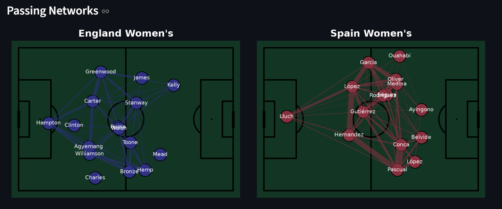
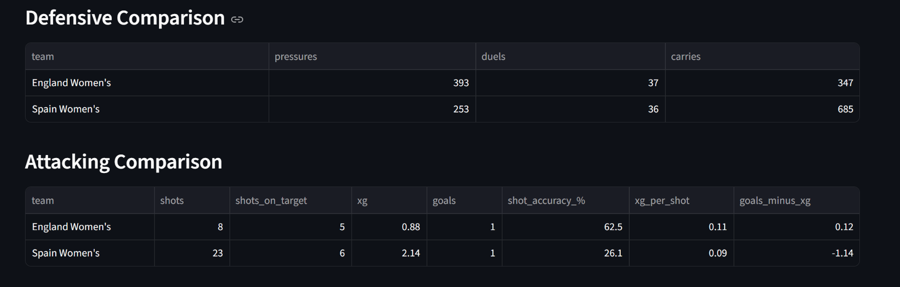

# UEFA Women's EURO 2025 Final — Football Match Analytics

## Live Dashboard

[View the live Streamlit dashboard](https://weurofinals2025.streamlit.app/)

## Project Overview

This project analyses the UEFA Women's EURO 2025 Final between **England Women's** and **Spain Women's** using event data from StatsBomb.

The aim was to compare both teams' attacking, passing and defensive performance and present the findings in an interactive Streamlit dashboard.

## Analysis

The project looks at:

* Shot volume and shot accuracy
* Expected goals (xG)
* Goals vs xG
* Passing volume and completion
* Progressive passes
* Final-third entries
* Passing networks
* Carries
* Pressures
* Duels
* Ball receipts as a possession proxy

## Tools & Technologies

* Python
* Pandas
* NumPy
* Matplotlib
* mplsoccer
* StatsBomb data
* Streamlit

## Files

* `main.py` — data processing and analysis
* `app.py` — Streamlit dashboard

## Dashboard

The dashboard presents the analysis through visualisations including shot maps, passing networks and team comparisons.

## Dashboard Preview

### Passing Networks

### comparison table

## Data

Match event data was obtained using the `statsbombpy` Python package and StatsBomb's open data.

## Purpose

This project was created as a football analytics portfolio project to demonstrate practical skills in **Python, data analysis, data visualisation and football analytics**.
